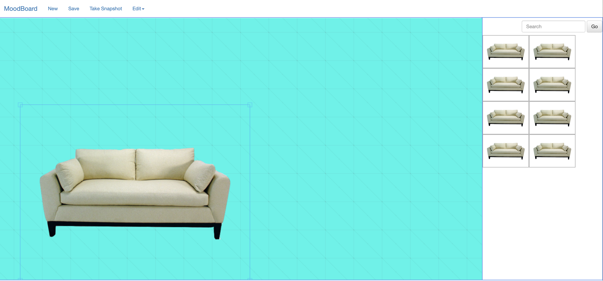

# Moodboard: Simple Design tool for interior designers [WIP]

## Requirement
This tool helps interior designers to intutively plan the project on 2D board first instead of creating a full fledge 3D model. Background and other photoes can be load from local files. 
